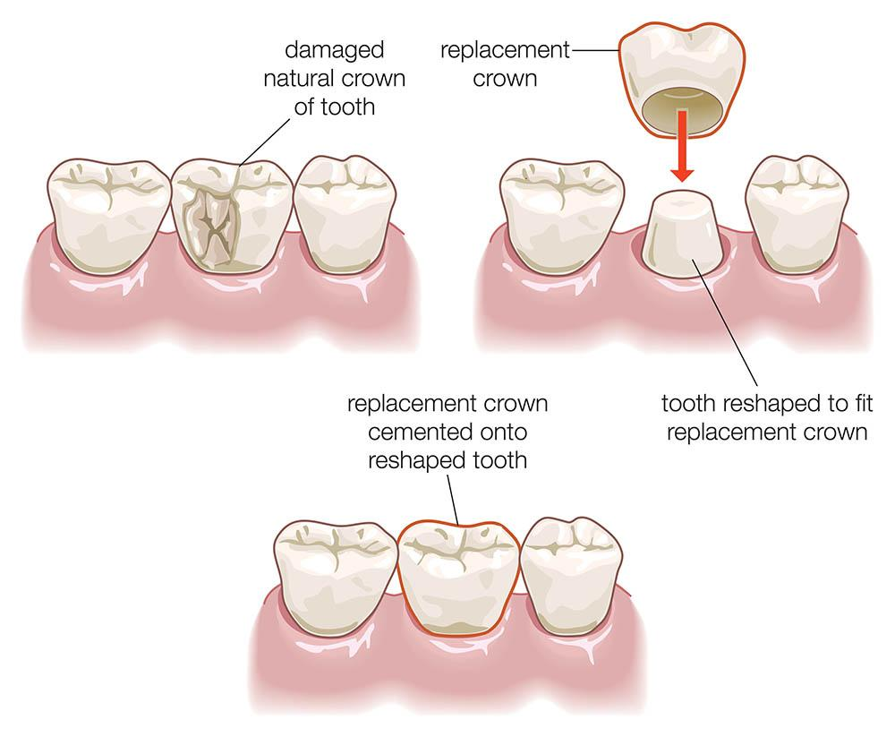

# Tech Challenge: Dental Crown Placement and 3D Viewer

## 1. Context

Build a web application that allows a user to inspect 3D dental meshes and automatically position a CAD-designed crown onto a prepared tooth scan from an intraoral scan.

This challenge has two major parts:

1. Build a custom 3D inspection viewer for dental meshes
2. Implement an automated method for crown placement on a tooth scan

The goal is to evaluate engineering judgment, frontend architecture, 3D rendering and interaction quality, handling of imperfect geometry, pragmatic algorithm design, and product thinking.

This is not an academic research task. A robust, clearly explained, practical solution is preferred over an unfinished ambitious one.

### Clinical Context



The practical workflow is:

1. A damaged tooth crown is reduced to a prepared stump.
2. A CAD-designed replacement crown is produced for that prepared shape.
3. The replacement crown is positioned and cemented on the preparation.

In real scan data, gingiva/soft tissue may overlap the virtual crown because tissue is not physically displaced in the digital workflow. A good placement method should therefore target the best feasible fit on the prepared tooth region and tolerate gingiva interference instead of forcing a perfect match everywhere.

### Data Context

Input data consists of:

- an intraoral 3D scan containing a prepared tooth stump
- a CAD-designed crown mesh corresponding to that preparation

The scan is expected to include real-world defects and noise (holes, irregular tessellation, artifacts, partial surrounding anatomy). The crown mesh is generally cleaner.

Target placement quality for this challenge: approximately `± 0.2 mm`.

The approach should generalize across all 5 provided scan/crown pairs without per-case hardcoding.

## 2. Assumptions, Requirements, Expectations, Stretch Goals

### Assumptions

- Repository is structured for 5 case folders under `apps/web/public/data/cases/`
- Provided assets may include a mix of STL and PLY scan data

### Requirements

1. Automated crown placement:
   Implement an automatic positioning approach (for example ICP-inspired, feature-based, PCA initialization, coarse-to-fine, or heuristic geometry reasoning).The method must generalize across all provided cases.
2. Visual verification:
   Reviewer must be able to inspect scan and crown together and judge plausibility of placement. For that an adequate STL/PLY File Viewer is needed.
4. User upload capability:
   Support drag-and-drop and manual file selection/deletion for STL/PLY files, with clear file/object state in UI.

### Viewer Expectations

- You may use existing 3D/viewer libraries.
- Lighting should be tuned for contour readability.
- Concave side should appear slightly darker than convex side to aid penetration checks.
- Avoid accidental back-face transparency artifacts that reduce readability.
- Camera interaction should be predictable and smooth on desktop and mobile (dynamics with low delay/inertia).
- Orthographic camera is preferred with FOV `<= 1°`.
- No rotational axis lock/limits.
- Show/hide each object.
- Independent transparency per object.
- Optionally independent color per object.
- Show textures when present and relevant.
- No gimmicks; focus on inspection workflow quality.

### Stretch Goals (Optional)

- collision or penetration visualization
- distance heatmap between crown and stump
- coarse-to-fine refinement stages
- lightweight quantitative scoring diagnostics

## 3. Given Setup (Scaffold, Structure, Local Run)

### Stack Defaults

- `npm` workspaces
- React + TypeScript (strict mode)
- Tailwind CSS v4
- shared UI primitives from `@repo/ui` (shadcn-style components)

Design direction is intentionally open. Treat the current styling as a starting point, not a visual limitation, as long as you stay consistent with project conventions.

### What Is Already Scaffolded

- application shell and layout
- upload panel placeholder
- viewer placeholder module
- placement API stub
- dataset folders under `apps/web/public/data/cases/`

You are allowed to change the shell to your own needs if necessary and justified.

### Candidate-Owned TODO Boundaries

- `apps/web/src/features/viewer/components/stl-viewer-workbench.tsx`
- `apps/web/src/features/placement/run-crown-placement.ts`
- `apps/web/src/features/scene/components/file-upload-panel.tsx`
- any additional viewer/geometry modules you create

### Project Structure

```text
.
├── apps/
│   └── web/
│       ├── public/data/cases/
│       │   ├── case-01/
│       │   ├── case-02/
│       │   ├── case-03/
│       │   ├── case-04/
│       │   └── case-05/
│       └── src/
│           ├── app/
│           ├── features/
│           │   ├── placement/
│           │   ├── scene/
│           │   └── viewer/
│           └── lib/
├── packages/
│   └── ui/
└── DECISIONS.md
```

### Local Setup

Prerequisites:

- Node.js `>= 22`
- npm `>= 10`

Install and run:

```bash
npm install
npm run dev
```

Validation:

```bash
npm run typecheck
npm run lint
npm run build
```

## 4. Submission

### Deliverables

1. Push your solution to a private GitHub repository.
2. Add `nexam-labs` as collaborator.
3. Include a completed `DECISIONS.md`.
4. Optionally include a short demo video.

### Time Limit

Time limit: 72 hours from when you start.

### Tips

- We value clear thinking (DECISIONS.md) as much as clean code.
- Don't over-engineer. 72 hours is tight. Ship something that works.
- Aim to make it as easy as possible for users to evaluate the feasibility of the crown design.

